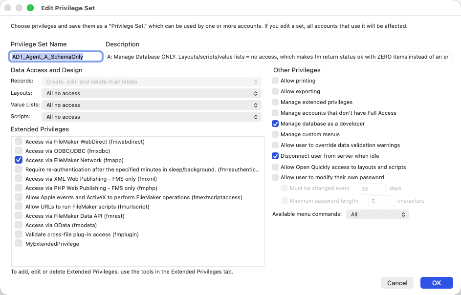
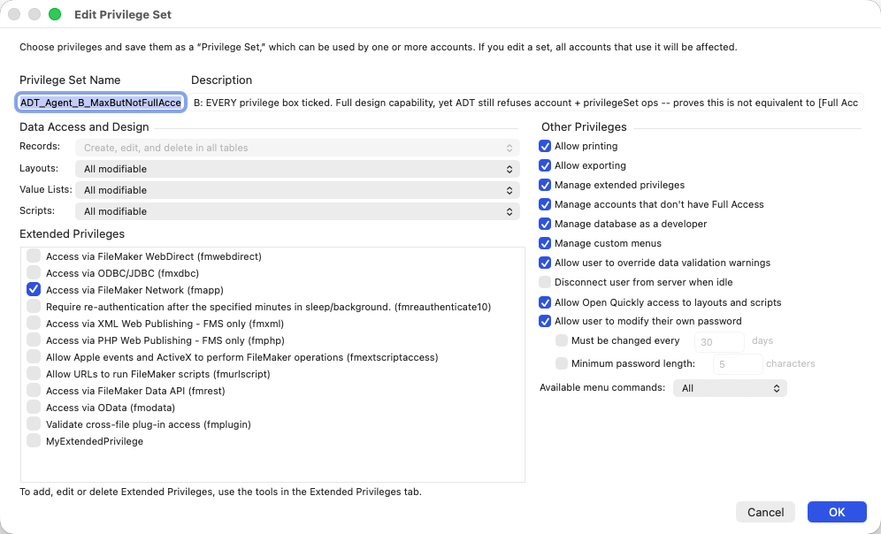

# What privileges the fm CLI needs, per catalog

Measured 2026-09-23 against **fm 0.8.0 (29834929)** and **FileMaker Pro 26.0**, on a file hosted over
`fmnet://`. Every capability claim below was produced by running the op as the account in question. Where
ADT's documentation, fm's help or fm's error text contradicts what was measured, both are quoted and
the measurement is what this document records.

## The short version

An account does not need `[Full Access]` to drive fm. Two privilege sets tell the whole story.

### Set A — a custom privilege set with "Manage database as a developer" and nothing else



**Can:** read and write tables, fields, relationships, table occurrences, custom functions, external
data sources, container base directories, graph notes, persistent data and file options. Read
everything else. Read and write every record in every table.

**Cannot:** write layouts, scripts, value lists, themes, custom menus or extended privileges. Touch
`account` or `privilegeSet` at all, reads included.

**Silently incomplete:** `read:layout`, `read:script` and `read:valueList` all answer `status: "ok"`
while returning none of the actual layouts, scripts or value lists. They do not fail — they report
success on a filtered result, with no error and no warning. See
[What filtering looks like](#what-filtering-looks-like).

### Set B — a custom privilege set with every privilege ticked (still not `[Full Access]`)



**Can:** everything A can, plus read and write layouts, scripts, value lists, themes, custom menus and
extended privileges. For every catalog but two it is indistinguishable from `[Full Access]`.

**Cannot:** read or write `account` or `privilegeSet`. And per Claris, manage accounts holding
`[Full Access]`, use Tools > Developer Utilities, or grant scripts full access privileges.

**B is the sensible default for an agent** — full design capability, no ability to change who can get
in. Deviate from it in only two directions, both deliberate:

- **Narrower**, if the agent genuinely has no business in some design area: withhold the Scripts,
  Value Lists or Layouts grant. Do it knowing that the corresponding reads then return a filtered
  subset with no indication anything is missing, and that withholding Layouts also removes theme
  creation.
- **Wider**, only if you intend the agent to work on the security schema itself — accounts and
  privilege sets. There is no middle setting for that: it requires handing the agent `[Full Access]`,
  which also hands it Developer Utilities and the ability to grant itself anything. That is a
  materially different trust decision from B, and it should be made on purpose rather than by
  reaching for `[Full Access]` because it was easier to configure.

One detail if you compare ADT's JSON against these dialogs: ADT reports `noIdleDisconnect: true` for
B, and B's screenshot shows "Disconnect user from server when idle" **unticked**. The key and the label
are inverses, so "every bit true" in ADT's output is not "every box ticked" in the UI.

## What must be granted

1. **fm running at all** requires the **"Manage database as a developer"** privilege — one specific
   checkbox under Other Privileges. No other privilege substitutes for it. The requirement is fm's
   own, not FileMaker's: an ordinary user on `[Data Entry Only]` opens the same file in FileMaker Pro
   and works normally. But fm opens the *schema* on every invocation, even to read one table name, so
   an account without this privilege gets `permission_denied` / dbError 207 and **not one op runs**,
   not even a read. Measured with a set holding every Other Privileges box except this one.

   The predefined `[Full Access]` set ships with the checkbox ticked, which is why a full-access
   account always works. A custom privilege set can tick the same checkbox.

   It is named differently wherever you look it up:

   | where | name |
   |---|---|
   | FileMaker Pro 26 dialog | **Manage database as a developer** |
   | ADT ops | `fileOptions.canManageDatabase` |
   | Claris online help (`other-privileges.html`) | "Manage database, data sources, containers, and custom functions" |

2. **Six catalogs then need a grant of their own**: layouts, scripts, value lists, themes, custom menus
   and extended privileges. The developer privilege does not cover their writes.

`account` and `privilegeSet` answer to neither of those: ADT refuses them, reads included, unless the
session literally holds `[Full Access]`, which it checks by a well-known internal key rather than by
the set's display name.

## The per-catalog table

Everything in the read column *also* needs the developer privilege, because without it fm refuses to
run at all.

| catalog | read | write |
|---|---|---|
| `table`, `field`, `relation`, `tableOccurrence` | developer privilege | developer privilege |
| `customFunction` | developer privilege | developer privilege |
| `externalDataSource`, `baseDirectory`, `graphNote`, `persistentData` | developer privilege | developer privilege |
| `fileOptions` | developer privilege | developer privilege (tested via `update:`) |
| `layout` | developer privilege — **content filtered by Layouts access** | Layouts = modifiable + allow creation |
| `script` | developer privilege — **content filtered by Scripts access** | Scripts = modifiable + allow creation |
| `valueList` | developer privilege — **content filtered by Value Lists access** | Value Lists = modifiable + allow creation |
| `theme` | developer privilege — not filtered | **Layouts** = modifiable + allow creation |
| `customMenu`, `customMenuSet` | developer privilege — not filtered | Manage custom menus |
| `extendedPrivilege` | developer privilege — not filtered | Manage extended privileges |
| `calculation` (`evaluate`, `validate`) | developer privilege | n/a |
| **`account`, `privilegeSet`** | **`[Full Access]` only** | **`[Full Access]` only** |

Three behaviours hide behind that table and are worth separating:

- **Filtered reads.** For `layout`, `script` and `valueList` the grant governs both operations: withhold
  it and writes are refused *and* reads return a filtered subset.
- **Writes only.** For `customMenu`, `customMenuSet` and `extendedPrivilege` the grant governs writes
  alone. A set holding neither "Manage custom menus" nor "Manage extended privileges" still read both
  catalogs in full.
- **Borrowed grant.** `theme` writes are governed by **Layouts** access, not by anything
  theme-specific. Isolated with a set holding the developer privilege and Layouts only: `create:theme`
  and `create:layout` were allowed while `create:script`, `create:valueList` and `create:customMenu`
  were refused. So granting Layouts silently grants theme creation as well.

## What filtering looks like

This is the behaviour most likely to mislead an agent, so it is worth seeing precisely.

A test file holds **22 layouts**. Three accounts read them, all holding the developer privilege,
differing only in their Layouts access:

| Layouts access | response | actual layouts returned |
|---|---|---|
| All modifiable | `status: "ok"`, `total: 22` | all 22 |
| One layout granted, other 21 withheld | `status: "ok"`, `total: 5` | **1** |
| All no access | `status: "ok"`, `total: 4` | **0** — the 4 items are folders |

fm reports all three as successes, with no error and no warning. Nothing in the response says a subset
was returned. `total` reports
what the *session* can see, not what the file holds — so a caller cannot compare `total` against the
returned array to detect filtering, because both shrink together. fm's help describes `total` as "how
many the file has, unfiltered", which is not what it does.

`script` and `valueList` behave identically, and they are the only other two that do — layouts,
scripts and value lists are the only catalogs with a per-catalog access setting for a privilege set to
withhold. Every other catalog returned the same results for every account tested, so there is nothing
to allow for elsewhere.

**What this means in practice.** A read cannot tell you whether it was complete. Reading the privilege
set would tell you, but that needs `[Full Access]`, which an agent account does not have. So the grants
have to be correct when the account is created. Nothing downstream can check them.

## Measured write results

`--dry-run`, which acquires the lock and evaluates privileges — a dry-run is refused exactly as a real
write is. `table` and `field` were additionally created, read back and deleted for real.

| create | Set A (custom: developer privilege only) | Set B (custom: every privilege, not `[Full Access]`) |
|---|---|---|
| `table`, `field`, `tableOccurrence`, `customFunction` | allowed | allowed |
| `externalDataSource`, `baseDirectory`, `graphNote`, `persistentData` | allowed | allowed |
| `fileOptions` (via `update:`) | allowed | allowed |
| `layout`, `script`, `valueList` | `create_failed` / dbError 9 | allowed |
| `theme` | `create_failed` / dbError 9 | allowed |
| `customMenu`, `customMenuSet` | `create_failed` / dbError 9 | allowed |
| `extendedPrivilege` | `create_failed` / dbError **207** | allowed |
| `account`, `privilegeSet` | `permission_denied` | `permission_denied` |

**A refused write reports `create_failed`, not `permission_denied`:**

    {"code": "create_failed", "message": "failed to create layout 'X'", "dbError": 9}

dbError 9 is FileMaker's *insufficient privileges*; the `code` does not say so, so error handling that
branches on `code` files a privilege problem as a generic failure. Branch on `dbError` — and note that
`create:extendedPrivilege` refused with **207** rather than 9, so the dbError is not consistent across
catalogs either.

## fm holds an exclusive schema lock, even for reads

Two fm sessions were pointed at the same file at the same time, both running **read-only** batches. One
completed every op; the other was refused outright:

    {"type":"fatal","error":{"code":"locked","dbError":303,
                             "lockedBy":["fm CLI 0.8.0 (admin)"]}}

`lockedBy` is the part that settles it: the holder is *the other fm session*. So fm serialises all
access per file, reads included — **two fm read batches cannot run concurrently against one file**, and
anything orchestrating parallel fm work has to serialise it.

**Always read `lockedBy` before concluding anything from a 303.** A refusal on its own says only that
something held the schema at that moment, and a FileMaker Pro window on Manage > Database or Manage >
Security is such a something. Only a 303 whose holder is another `fm CLI` session is fm serialising
itself. Treating a bare 303 as the second fact produced a wrong conclusion during this work, in both
directions.

ADT's guidance adds that FileMaker Pro holds the same lock while Manage > Database is open (the
relationships graph included) and while a script is open for editing — so a developer with either
window open blocks an agent entirely. That part is documented rather than measured here, but a related
case was hit by accident during this testing: with Manage > Security open in FileMaker Pro,
`create:privilegeSet` failed with `create_failed` / **dbError 8003**, "failed to open the privilege set
catalog for writing".

### 207 and 303 mean opposite things

- **dbError 207** — the password was accepted and the account lacks the developer privilege. Trying
  again will fail identically no matter what password is used, because the password is not the problem.
  Grant the privilege or use a different account. Retrying credentials here is worse than useless:
  repeated login failures can temporarily lock a real account out (dbError 214).
- **dbError 303** — another session currently holds the schema. The request is fine; wait and run it
  again. `lockedBy` names who is holding it.

fm's own 207 message goes on to claim the op needs a `[Full Access]` account, which is measurably
false — see ["Full Access" means two different things](#full-access-means-two-different-things-and-the-docs-do-not-separate-them).

## The security cost

Ticking the developer privilege forces Records to *create, edit, delete in all tables* and locks it —
visible greyed out in both screenshots. A schema-capable agent account therefore has **full read/write
access to every record in the file**. A "may change the schema, may not touch the data" agent is not
expressible in FileMaker's privilege model.

## Recipe

Run as an existing `[Full Access]` account. This builds B; omit the last three grants for A.

```jsonc
{"op":"create:privilegeSet","name":"AgentSchema",
 "fileOptions":{"canManageDatabase":true,"menuCommands":"all"},
 "records":{"access":"createEditDelete"},
 "layouts":{"access":"allModifiable","allowCreation":true},
 "scripts":{"access":"allModifiable","allowCreation":true},
 "valueLists":{"access":"allModifiable","allowCreation":true}}
```

`menuCommands: "all"` is not optional — Claris documents that the developer privilege needs Available
menu commands set to All to be usable. Add `canManageCustomMenu` / `canModifyExtensions` if the agent
must write custom menus or extended privileges. Note that a blanket `layouts.access` cannot be combined
with a per-layout `layouts` array; fm refuses the pair with `invalid_field`.

Then grant `fmapp`, **sending the full list of holders** — `privilegeSets` replaces rather than appends,
so omitting an existing holder revokes it:

```jsonc
{"op":"update:extendedPrivilege","name":"fmapp","sharing":"specified",
 "privilegeSets":["[Full Access]","<every existing holder>","AgentSchema"]}
```

Then the account:

```jsonc
{"op":"create:account","name":"agent","privilegeSet":"AgentSchema","password":"…","enabled":true}
```

Keep the password in the ops file rather than on the command line: `--password` is visible in the
process list. For the agent's own runs, use `--store-credentials` once and `--keychain` after.

**Teardown:** revoke `fmapp` from the set before deleting it, or the delete fails with `delete_failed`
/ dbError 8406. Within one batch this bites by ordering — a `delete:privilegeSet` fails against a grant
that a later op in the same batch removes.

## Two catalogs fm cannot write at all

Not a privilege matter, and noted only so nobody hunts for the grant that enables them. `create:` on
either is refused for every account including `[Full Access]`, with `unsupported_operation` and an
explanation:

- `font` — *"the font catalog is FileMaker-managed and cannot be added to"*. Housekeeping; no
  consequence for an agent.
- `authorization` — *"an authorization is a pairing across TWO files"*, so it cannot be created from one
  side. This one matters: it is Manage > Security > File Access. It is readable, so an agent can report
  which files are authorized, but it cannot alter the pairing from here.

## "Full Access" means two different things, and the docs do not separate them

Everything in this document follows from one phrase carrying two meanings across ADT's
documentation, fm's help, and fm's error text:

- **The `[Full Access]` privilege set** — the specific predefined set, which fm identifies by a
  well-known internal key rather than by its display name.
- **Schema privilege** — the "Manage database as a developer" checkbox, which `[Full Access]` happens
  to include but which any custom privilege set can also hold.

Only two catalogs need the first. Everything else needs the second. No source states the distinction,
and three of them actively blur it.

### Where each source lands

**The official ADT help** ([help/install_and_connect.md](../help/install_and_connect.md)) asks for the
privilege set, with no qualification:

> "Enter a **\[Full Access]** account — ADT needs Full Access to work on the file."

and states it again as a property of the CLI:

> "`filemaker` is its own headless FileMaker client, signed in with a Full Access account it holds for
> the file."

Read literally, that is a requirement no measurement supports: sets A and B here are not
`[Full Access]` and do every catalog but two.

**fm's 207 error text** uses the phrase to mean schema privilege, while looking like it means the set:

> "the account authenticated and was then refused the schema lock. fm-cli requires a FULL-ACCESS
> account for every operation, including every `read:`"

The first clause is accurate and the second is not. An operator who reads it does the wrong thing —
provisions `[Full Access]` — and it works, so nothing ever corrects the belief.

**ADT's shipped agent skill** (`agent-plugin/skills/fm-cli/SKILL.md`) contradicts itself inside one
bullet:

> "There's no read-only mode: every `read:` and even `--dry-run` needs full access, so this blocks the
> whole tool. Ask the user for a full-access account; don't tell them the account 'has no access' —
> only that it lacks schema privilege."

The last clause is exactly right, and it is the opposite of the instruction two sentences earlier. An
agent following this tells the operator to supply `[Full Access]`.

**fm's help for `account` and `privilegeSet`** is the one place the phrase means the set, and means it
strictly:

> "EVERY VERB on this catalog, including read, additionally requires the calling session itself to hold
> [Full Access]."

Measured: true, and enforced by internal key. So fm uses the same phrase for a real
`[Full Access]`-only restriction in one place and for a merely-schema-privilege restriction in another,
with nothing to tell the two apart.

### Why it matters

The ambiguity has a security consequence, not just an editorial one. An operator following the
documentation hands an AI agent an account that can rewrite the file's security: create accounts,
change privilege sets, grant itself anything, and use Developer Utilities. A set built as B here can do
the design work and none of that.

The narrower reading also costs nothing to adopt — B needs no capability fm lacks, and fm already
refuses `account` and `privilegeSet` to it, so the restriction is enforced by the tool rather than by
convention.

### What would settle it

Distinct vocabulary in all four places. "Requires schema privilege (Manage database as a developer)"
for the common case, and "requires the `[Full Access]` privilege set" only where that is literally
true. fm's 207 message is the highest-value fix: it is the one an operator reads at the moment they are
deciding which account to create.
